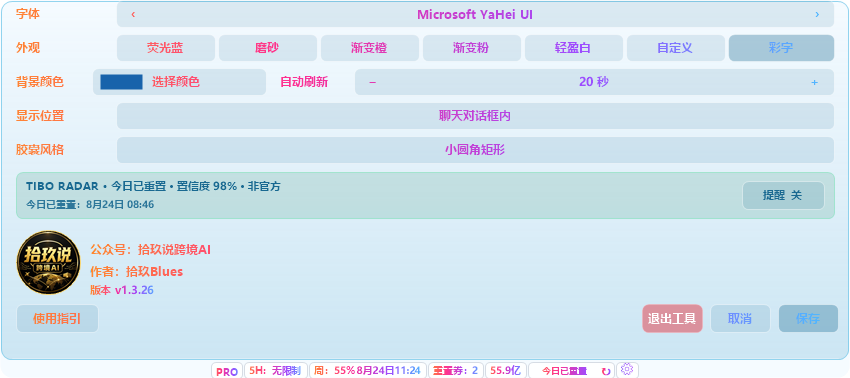
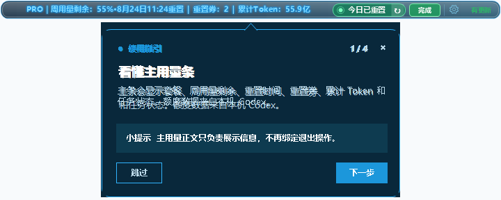
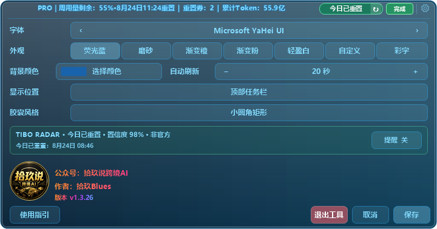
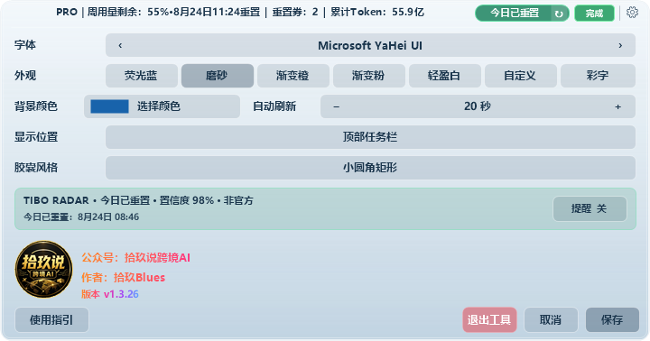
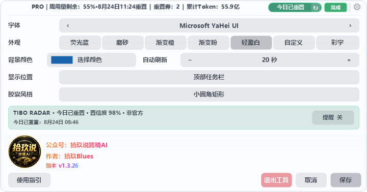
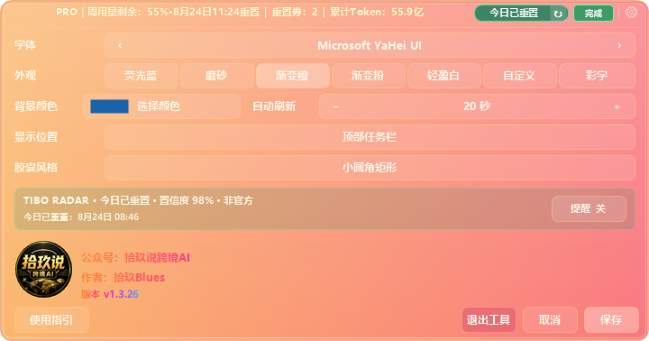
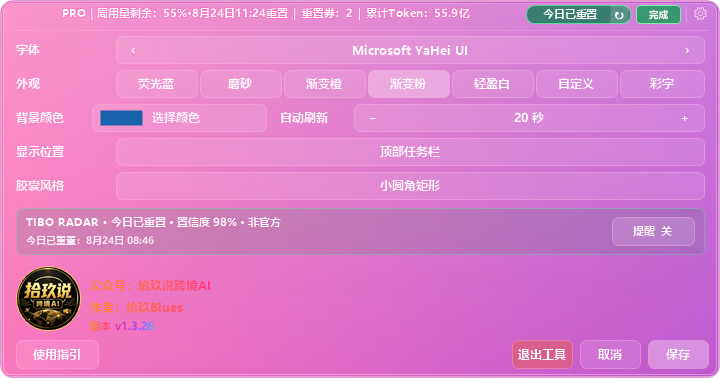

# Codex Usage Overlay

一个面向 Windows Codex 桌面应用的轻量用量悬浮条。它跟随 Codex 窗口显示账户套餐、周用量剩余、重置时间、可用重置券、累计 Token、当前任务状态，以及基于公开非官方来源整理的 Tibo 重置预告。

设置面板中的公众号名与作者署名在所有主题下默认使用渐变彩字。

## 为什么做这个工具

Codex 的剩余用量信息需要进入“设置 → 剩余用量”才能查看。使用频繁时，为了确认还能用多少、什么时候重置，每次都要打开设置页面，会打断当前工作。

这个工具把常用信息放到 Codex 窗口顶部：周用量剩余比例、重置时间、重置券、累计 Token 和任务状态都能直接看到。目标很简单——不用离开当前任务，也不用反复点击设置，一眼就知道用量情况。


> 上方概览图由 v1.3.1 实机程序真实渲染，记录作者授权公开的 2026-08-10 状态；以下主题图使用固定演示数据。图片不代表读者账户或当前状态。

## 界面预览

以下主题图全部由当前程序自身的界面绘制代码重新导出，不是 AI 生成图；其中的数值均为固定演示数据。

### 聊天对话框胶囊

仅在实际对话界面显示；切换到设置、插件、项目等页面会自动隐藏。显示位置可选“顶部任务栏”“聊天对话框内（与完全访问同一行）”“聊天对话框下面”。点右侧齿轮后，设置从胶囊行向上展开。可在设置中切换“圆角”“小圆角矩形”“无胶囊”三种风格。


圆角：


小圆角矩形：


无胶囊：




### 首次使用指引

未发现现有设置配置时，首次启动会在主用量条旁显示四步会话气泡指引。气泡会跟随主条移动；Codex 暂时失焦或最小化时会隐藏，回来后继续当前步骤。完成、跳过或关闭后不再自动出现，在设置中可随时重新打开。




### Tibo 重置预告窗

正常显示：


鼠标靠近右上角后显示红色 ×：


红色 × 会关闭当前会话的顶部预告窗；单击主条中加粗的雷达状态块，或单击预告窗主体，都会打开 [Codex Runway 中文页](https://www.codexrunway.com/zh.html)。

### 渐变彩字

顶部信息栏使用透明背景；展开设置时，下方设置区保留浅色磨砂底，设置文字同样使用渐变彩字。

收起：


展开：


### 荧光蓝

收起：


展开：



### 透明磨砂玻璃

收起：


展开：



### 轻盈白

白色卡片、细灰描边与紫蓝绿橙状态点；底部模式会以同样风格区分套餐、5 小时、周用量与 Token。

收起：


展开：



底部胶囊：


### 浅色渐变橙

收起：


展开：



### 渐变粉

收起：


展开：



## 功能

- 显示 Codex 返回的套餐名称，不自行添加“20X”等文案。
- 显示长周期／周用量剩余比例和重置时间。
- 支持“顶部任务栏”“聊天对话框内”“聊天对话框下面”三种显示位置；后两种仅在 Codex 实际对话界面显示，并会在窗口缩放时重新对齐输入框，按 `PRO`、`5H`、`周`、`重置券`、累计 Token 数值顺序显示。
- 显示可用重置券数量。
- 显示个人资料中的账户累计 Token（`summary.lifetimeTokens`）。
- 显示任务状态：处理中、完成、中断、检测中。
- 显示 Tibo 重置雷达：今日已重置、今日有预告、未来已预告、暂无信号或雷达离线。
- 有明确预告时，在周用量条上方显示独立悬浮预告条，包含置信度、计划时间区间和秒级倒计时；展开设置时自动隐藏，避免重复。鼠标移到右上角可用红色 × 关闭当前会话的预告窗。
- 单击主条中的任意雷达状态块，包括“暂无重置信号”“雷达离线”“今日有预告”和“今日已重置”，都会打开 Codex Runway 中文状态页。展开设置中的来源卡片仍可打开经过严格校验的 `@thsottiaux` 原帖；Windows 通知按原帖编号去重。
- 自动刷新，可在设置中调整刷新秒数；雷达右侧的 `↻` 按钮可立即强制刷新。
- 兼容 Tibo 状态源新的 reset-bank 说明格式；单次网络失败时保留有效缓存并每 60 秒重试，超过 30 小时未更新才显示“雷达离线”。
- 后台检查 GitHub 稳定版 Release；发现新版本时显示 Windows 提醒，点击后打开对应 Release 页面，不静默下载或安装。
- 未发现现有设置配置时，首次使用会在主用量条旁显示一次四步会话气泡指引；完成、跳过或关闭后不再自动出现，也可在设置中随时重新查看。
- 单击任意雷达状态块会打开 [Codex Runway 中文状态页](https://www.codexrunway.com/zh.html)，核对 Tibo 的公开重置计划与历史记录。
- 右键齿轮会打开彩字主题菜单，可查看当前版本、检查或下载 GitHub 稳定版更新，也可选择“退出程序”并二次确认。
- 主条中的 `PRO｜周用量剩余…` 正文只展示信息，不绑定退出操作。
- 支持荧光蓝、磨砂玻璃、渐变橙、渐变粉、轻盈白、渐变彩字 6 种预设主题和自定义背景色；主题同时作用于主条与顶部预告窗。
- 跟随 Codex 窗口居中；顶部任务栏模式垂直居中，聊天对话框内模式与“完全访问”同一行，聊天对话框下面模式贴住整个输入框外沿。顶部预告窗不会把主条向下挤。支持窗口最大化和高 DPI 显示器。
- 随 Windows 登录自动启动，并创建桌面快捷方式。
- 支持用同一安装包直接覆盖更新；运行中的版本会提示可用的新稳定版。

## 系统要求

- Windows 10 或 Windows 11。
- 已安装并登录 Codex 桌面应用，或已安装并登录官方 Codex CLI。
- 系统自带 .NET Framework 4.x。

## 下载与安装

1. 从 [v1.3.6 安装包](https://github.com/ivan51769/CodexUsageOverlay/raw/refs/heads/main/dist/blues19-CodexUsageOverlay-Setup-1.3.6.exe) 下载 `blues19-CodexUsageOverlay-Setup-1.3.6.exe`。
2. 同一 `dist` 目录提供 `SHA256SUMS.txt`，可用于校验安装包完整性。
3. 双击安装包，按提示完成安装。
4. 安装结束后工具会自动启动，同时创建桌面快捷方式。
5. 打开 Codex，悬浮条会出现在窗口顶部菜单栏中央。

以后更新时直接运行新版安装包即可覆盖安装，设置会保留。

## 交给 Agent 一键安装

如果电脑上有 Codex、Claude Code 等可以执行 Windows 操作的 Agent，可以直接复制 [Agent 一键安装部署提示词](AGENT_INSTALL_PROMPT.md)。提示词包含环境检查、下载安装、SHA-256 校验、静默覆盖更新、启动验证和安全边界。

## 首次启用与账户读取

工具优先寻找 Codex 桌面应用随附的 `codex.exe`，也支持系统中已安装的 Codex CLI。只要 Codex 已正常登录，一般无需额外配置。

如果工具无法读取账户数据，可以安装并登录官方 Codex CLI：

```powershell
npm.cmd install --global @openai/codex
codex.cmd login --device-auth
```

如需指定自定义 CLI 路径，可设置用户环境变量：

```powershell
[Environment]::SetEnvironmentVariable(
  "CODEX_CLI_PATH",
  "C:\path\to\codex.exe",
  "User"
)
```

设置后重新启动工具。

## 使用方法

- 单击右侧齿轮：展开设置面板；再次单击会保存本次修改并收起。
- 字体：使用左右箭头切换。
- 外观：选择预设主题或自定义颜色，点击后立即预览；再次单击齿轮或单击“保存”会保存并收起，只有“取消”会放弃修改。
- 自动刷新：使用 `−`、`+` 调整间隔，最短为 5 秒。
- 顶部预告窗：单击主体打开 [Codex Runway 中文页](https://www.codexrunway.com/zh.html)；鼠标移到右上角可用红色 × 关闭当前会话的预告窗。主条中的任意雷达状态块也会直接打开中文状态页。
- Tibo 原帖：单击展开面板中的雷达卡片查看对应公告原帖。
- 重置提醒：在雷达卡片右侧切换，默认关闭；保存后生效。
- 使用指引：在展开设置或开始菜单“显示设置”中点击“使用指引”，可随时重新学习。
- 保存：应用并保存设置；从开始菜单的“显示设置”保存后，运行中的悬浮条会自动更新，无需重启。
- 取消：放弃本次修改。
- 版本号：展开设置后可在作者信息下方查看，固定使用渐变彩字显示。
- 退出工具：右键齿轮，选择“退出程序”并确认；也可展开设置后单击“退出工具”。再次运行桌面快捷方式即可恢复。

## 数据来源与隐私

账户信息通过 Codex CLI 的本地 `app-server` JSON-RPC 接口读取，包括 `account/read`、`account/rateLimits/read` 和 `account/usage/read`。

只有在确认 ChatGPT 登录身份并读到有效额度窗口后，工具才会更新套餐与额度缓存；登录异常或返回字段不完整时会保留上一次成功结果，避免把套餐误显示为 Free 或清空已有额度。

任务状态通过本地 `.codex\sessions` 事件类型判断。聊天对话框模式仅使用 Windows 的控件类型与边界位置识别是否存在对话输入区，不读取输入内容或对话正文。工具不上传账户额度、令牌或对话正文，不直接读取或写入 `auth.json`。Tibo Radar 只读请求公开状态源；刷新失败时会保留上一次成功数据，避免阻塞 Codex 窗口。

Tibo 重置雷达每 10 分钟只读请求 [Codex Runway](https://www.codexrunway.com/) 的公开非官方 JSON 状态源，不发送账户令牌、本机额度或其他本地数据。客户端只接受带时区的时间和严格匹配 `https://x.com/thsottiaux/status/<数字编号>` 的来源。该状态源不是 OpenAI 官方承诺，公告也不保证每个账户同时到账；实际额度以本机 Codex 返回结果为准。

版本检查只读请求本项目的 GitHub `releases/latest` 接口，仅发送常规 HTTPS 请求和程序版本 User-Agent；失败时静默忽略，不上传账户额度、令牌、设置或对话内容，也不会自动下载安装包。

运行数据保存在安装目录：

- `usage-cache.ini`：最近一次成功读取的套餐、额度和累计 Token。
- `settings.ini`：字体、主题、自定义颜色、刷新秒数、通知开关和首次指引状态。
- `reset-radar-cache.json`：最近一次通过校验的公开重置状态。
- `reset-radar-state.ini`：近期已通知的公开原帖编号，用于防止重复提醒。

这些本机文件均已从 Git 仓库排除。

## 开源许可证与来源

本项目以 [GNU Affero General Public License v3.0](LICENSE) 发布。Tibo 重置状态的协议校验与本地日期判断行为基于 [Codex Runway](https://github.com/Licoy/codex-runway) 的公开实现适配为 Windows C#/.NET Framework 版本；修改日期、上游版本和非官方边界见 [THIRD_PARTY_NOTICES.md](THIRD_PARTY_NOTICES.md)。

发布安装包时，完整对应源码、构建脚本、许可证和来源说明均在本仓库中提供。

## 从源码构建

```powershell
powershell.exe -NoProfile -ExecutionPolicy Bypass -File .\test.ps1
powershell.exe -NoProfile -ExecutionPolicy Bypass -File .\build.ps1
.\bin\CodexUsageOverlay.exe --snapshot
.\bin\CodexUsageOverlay.exe --reset-radar-snapshot
.\bin\CodexUsageOverlay.exe "--export-theme-previews=.\docs\images\themes"
```

最后一条命令会重新生成 10 张主题图，以及顶部预告窗的正常／红色 × 悬停状态图。

安装包使用 Inno Setup 6 编译：

```powershell
ISCC.exe .\installer.iss
```

生成文件位于 `dist` 目录。

## 免责声明

本项目是非官方辅助工具，与 OpenAI 无隶属或背书关系。Codex 和 OpenAI 是其各自权利人的商标。

## ☕ 请作者喝杯咖啡

如果这个小工具节省了你的时间，可以自愿支持作者。

- 公众号：拾玖说跨境AI
- 作者：拾玖Blues


