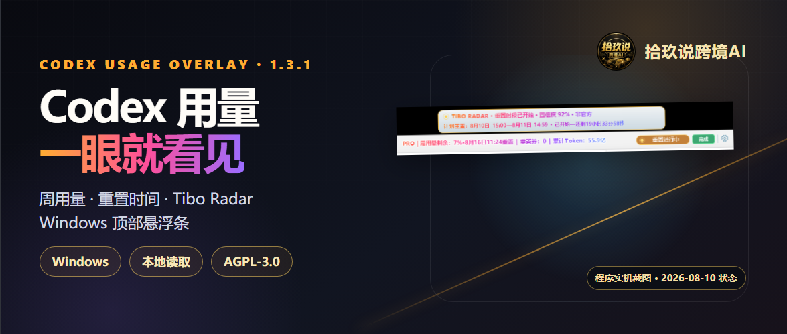
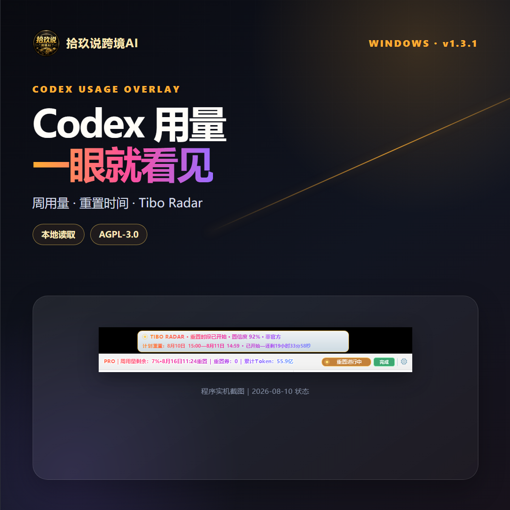

# 微信公众号发布包：Codex Usage Overlay v1.3.1

发布状态：**公众号草稿已更新，未群发** 
公众号：拾玖说跨境AI 
作者：拾玖Blues 
- 作者：拾玖Blues
规则核对日期：2026-08-10（正式发布当天仍需在公众号后台复核）

## 标题候选

1. 结果型：错过一次 Tibo 重置，像错失一个亿，我把预告接进了 Codex
2. 痛点型：重置卡刚用完，Tibo 又发重置预告了
3. 经历型：我给 Codex 做了个用量悬浮条，把 Tibo 预告放到了眼前

推荐标题：**错过一次 Tibo 重置，像错失一个亿，我把预告接进了 Codex**

## 封面

横版主封面（2.35:1）：

分享方图（1:1，独立排版，不是横图裁切）：

### 配图清单

| 图片 | 插入位置 | 尺寸 | 来源与授权 | 演示数据 | 状态 |
| --- | --- | --- | --- | --- | --- |
| `cover-1175x500.png` | 公众号主封面 | 1175×500 | 2026-08-10 项目实机状态截图与原创排版 | 2026-08-10 状态 | 已准备 |
| `cover-square-1080x1080.png` | 分享卡片方图 | 1080×1080 | 2026-08-10 项目实机状态截图与原创排版 | 2026-08-10 状态 | 已准备 |
| `01-overview-1080x1440.png` | 正文开场后 | 1080×1440 | 项目自身渲染组件与原创排版 | 固定演示数据 | 已准备 |
| `02-tibo-radar-1080x1440.png` | Tibo Radar 小节后 | 1080×1440 | 2026-08-10 项目实机状态截图、程序导出截图与原创排版 | 实机状态与固定交互示例 | 已准备 |
| `03-themes-1080x1440.png` | 主题小节后 | 1080×1440 | 项目最终程序导出与原创排版 | 固定演示数据 | 已准备 |
| `04-data-boundary-1080x1440.png` | 数据边界小节后 | 1080×1440 | 项目原创信息图 | 不含账户数据 | 已准备 |
| `05-codex-runway-source-1080x1440.png` | Tibo Radar 小节后 | 1080×1440 | Codex Runway 中文页面实拍与原创排版 | 2026-08-10 公开页面状态 | 已准备 |
| 私密素材：个人微信二维码 | 正文 CTA 后 | 777×1115 | 作者本人二维码，本轮明确授权用于公众号草稿 | 含本人微信名、头像和地区 | 已准备；不纳入公开仓库 |

## 摘要

错过 Tibo 的重置公告，或在重置卡刚用掉后碰上新的重置窗口，很容易让人觉得额度没安排好。这次更新把公开非官方预告接进 Windows Codex 悬浮条，提前显示本地时间和倒计时，方便安排手里的额度。

## 正文

我用 Codex 最怕碰上两种情况。

一种是周额度还没用完，第二天才看到 Tibo 发过重置公告。明明没有真少一分钱，心里还是像错失了一个亿。手里的额度原本还能多跑几个任务，消息看晚了，只能拍一下大腿。

另一种更扎心。重置卡刚用掉，任务还没跑几个，又碰上新的重置窗口。不同账户不保证同时到账，这张卡也不能简单算作浪费。可卡换来的额度还没有来得及用，心里总会冒出一句，早知道就再等等。

我想解决的就是这个“早知道”。预告早一点出现在眼前，我可以先安排今天剩下的额度，再决定重置卡要不要等一等。长任务也不用完全凭感觉开。

所以 v1.3.1 把 `TIBO RADAR` 接进了 Codex Usage Overlay。公开的非官方重置信号会直接显示在 Codex 窗口上方，时间按本地时区换算，还会告诉我距离计划窗口有多久。

[图1：不用再点进设置]

### 预告早点出现，额度才好安排

有明确排期时，Codex 标题栏上方会出现一条独立预告窗，显示计划时段、倒计时和来源给出的分类置信度。计划窗口开始后，预告窗会显示“重置时段已开始”，主条同步显示“重置进行中”。

我会把它当成一个提前量。计划窗口已经很近，周额度还剩不少，就先把确定要跑的任务排进去。手里有重置卡，任务又不着急，我会多看一眼预告再决定什么时候用。没有明确预告时，照常按当前任务用，不拿猜测当到账消息。

这套东西不能替我把额度变多。它只是让公开信号早一点出现在眼前，少一次事后才知道。

鼠标靠近预告窗右上角会出现红色关闭按钮。临时关掉后，单击主悬浮条里的加粗重置状态胶囊，可以重新打开。单击预告窗主体，则会进入 Codex Runway 中文页面查看公开状态信息。

[图2：Tibo Radar 预告与交互]

### Tibo Radar 的信息从哪里来

Codex Usage Overlay 不直接访问或抓取 X。Tibo Radar 每 10 分钟只读查询 Codex Runway 汇总的公开非官方状态。Codex Runway 负责跟进并分类 Tibo（`@thsottiaux`）的公开 X 帖，悬浮条负责校验事件结构和时间，再换算成本地时间展示。

客户端会检查事件时间和来源链接。信息过期、状态源离线或者只剩缓存时，顶部不会把旧预告当成一条刚来的消息展示。

“预告”表示公开帖被分类为明确排期。“今日已重置”表示 Tibo 发布了完成公告。两者都不等于某个账号已经到账。图里出现的置信度，描述的是上游对事件分类的判断，不代表账户到账概率。

https://www.codexrunway.com/zh.html

[图3：Codex Runway 公开来源页面]

### 额度和任务状态还是一眼看得到

主悬浮条会显示套餐、周用量剩余和下一次重置时间。有可用重置券时，它会和累计 Token 一起显示在条上。当前任务是处理中、完成还是中断，也不需要再离开正在写的代码去确认。

套餐名称和额度都以本机 Codex 返回的数据为准。这里没有自己拼出来的“20X”之类文案。

这一版也修了部分电脑在混合缩放或异常字体设置下出现的文字空白、错位和裁切。主题切换会立即预览，选择主题后再次单击齿轮或单击“保存”就会保留修改。主条和顶部预告窗会同步使用同一主题。

[图4：主题与设置]

### 账户数据只留在本机

账户与用量通过本机 Codex CLI 的 `app-server` 接口读取。任务状态只读取本机 `.codex\sessions` 中的事件类型。

工具不会直接读取或写入 `auth.json`，也不会保存对话正文。Tibo Radar 读取 Codex Runway 的公开 JSON 状态时，不会把本机账户令牌、额度或累计 Token 发给这个状态源。

最近一次成功读取的用量、主题设置和雷达状态会保存在本机安装目录。刷新失败时，工具会继续显示上一次成功结果，也会避免重复提醒。

[图5：数据来源与边界]

### 它只给我一个提前量

这个工具目前只面向 Windows 10 和 Windows 11。电脑上还需要安装并登录 Codex 桌面应用，或者安装并登录官方 Codex CLI。

它不能主动增加额度、绕过限制或强制触发重置。预告窗里的倒计时只说明计划窗口，最终是否重置、实际还剩多少额度，都以本机 Codex 返回结果为准。

没有明确排期时，照常按任务需要使用。公开状态源依赖网络，状态源离线或者没有可验证来源时，顶部预告窗不会继续冒充在线新消息。

### 现在可以去哪里看

项目已按 AGPL-3.0 发布到 GitHub。v1.3.1 Release 提供 Windows 安装包和 SHA-256 校验文件，仓库也公开了源码、安装要求和数据边界。

Codex Usage Overlay 是非官方辅助工具，与 OpenAI 没有隶属或背书关系。Codex、OpenAI、Codex Runway 以及文中提到的第三方名称，归各自权利人所有。

如果你也遇到过额度还没安排好就错过预告，或者刚用完重置卡又碰上新的重置窗口，这条悬浮栏至少能让公开信号早一点出现在眼前。少一次“早知道就好了”，对我已经值回这次更新。

### 获取安装包

**想获取 Windows 安装包，加我微信获得下载链接。** 下方为“拾玖 Blues”个人微信二维码。

[图6：拾玖Blues 个人微信二维码]

**AI 辅助说明** 本文由作者基于真实项目源码、程序导出截图与本地测试资料整理，使用 AI 辅助编辑和排版；功能、图片与事实结论均由作者人工复核。

## 配图清单

图片来源、尺寸与公开数据状态详见本文开头的配图清单；草稿正文按图1至图6顺序上传，第6图为获授权的私密二维码。

## AI 辅助声明建议

本文由作者基于真实项目源码、程序导出截图与本地测试资料整理，使用 AI 辅助编辑和排版；功能、图片与事实结论均由作者人工复核。

## 发布前检查

- [x] GitHub 远端已指向本次最终提交，公开链接可访问。
- [x] v1.3.1 Release 已建立，安装包与 `SHA256SUMS.txt` 均可下载。
- [x] 产品界面图均为本轮最终程序重新导出或基于真实导出图排版；个人二维码为作者本人素材并由作者本轮明确要求用于公众号草稿。
- [x] 2026-08-10 实机截图中的用量、重置时间与 Token 数据已获作者本轮公开授权；产品图中无账号、聊天内容、路径、Cookie、验证码或令牌，唯一可识别个人信息是获授权的作者微信二维码。
- [x] 正文主 CTA 为加作者微信获取下载链接，未配置文章底部跳转入口。
- [ ] 微信公众号后台已按发布当天规则核对外链、个人微信二维码与加微信获取下载链接、第三方名称、AI 辅助声明和原创声明。
- [x] 未使用“官方工具”“自动重置”“保证到账”等不准确表述。

合规风险：**黄色，发布后台复核后再发**。主要原因是外部状态源链接、个人微信二维码与获取安装包的互动引导、第三方名称和 AI 辅助编辑。不代表内容违规。
