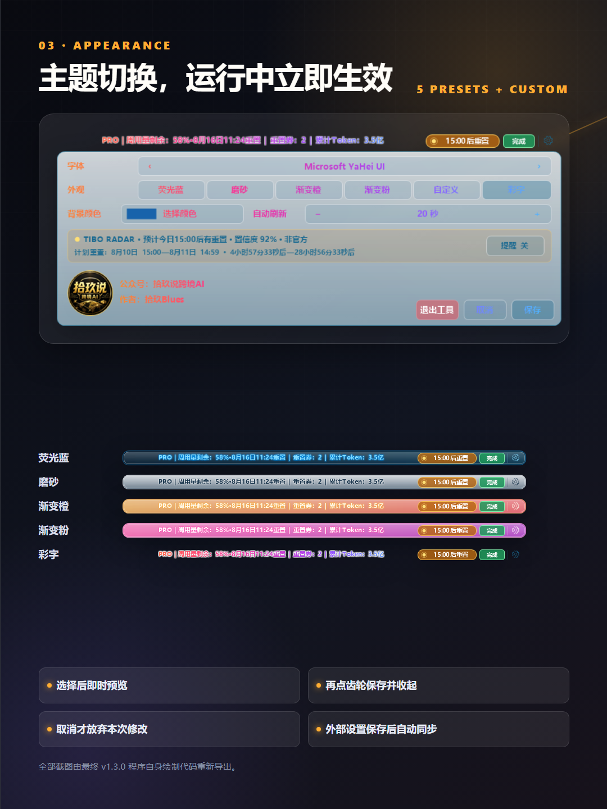
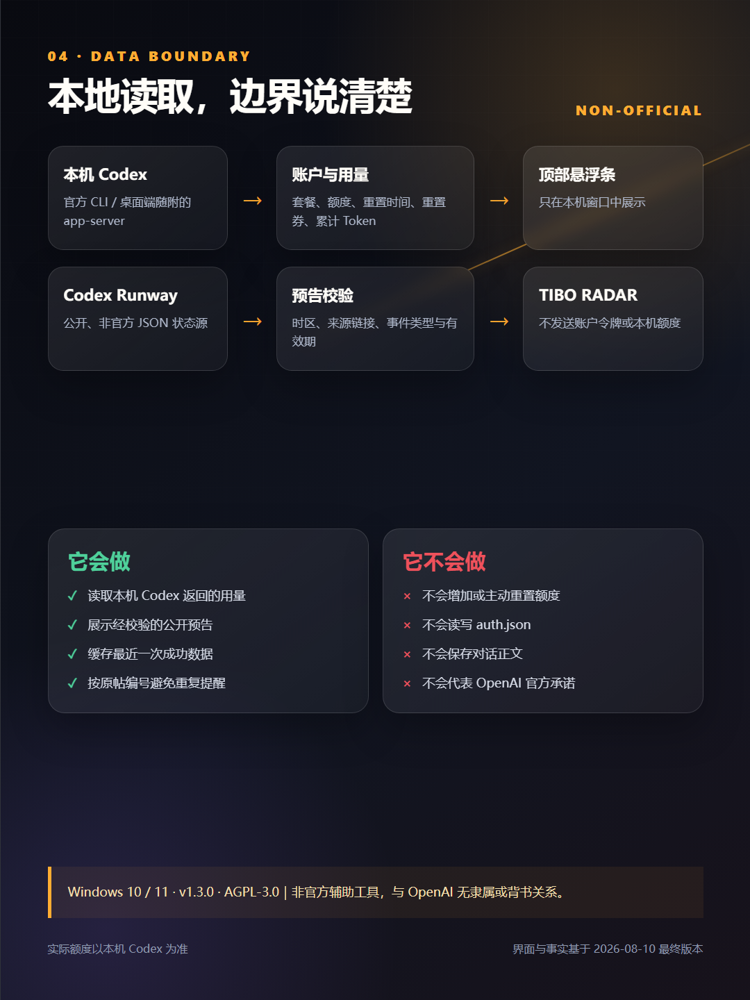

# 微信公众号发布包：Codex Usage Overlay v1.3.0

发布状态：**未发布** 
公众号：拾玖说跨境AI 
作者：拾玖Blues 
阅读原文：https://github.com/ivan51769/CodexUsageOverlay
规则核对日期：2026-08-10（正式发布当天仍需在公众号后台复核）

## 标题候选

1. 结果型：现在一眼就能看到 Codex 周用量和重置时间
2. 痛点型：每次都要进设置看用量？我把它做成了 Codex 悬浮条
3. 经历型：我给 Codex 做了个用量悬浮条，这次把重置预告也接进来了

推荐标题：**每次都要进设置看用量？我把它做成了 Codex 悬浮条**

## 摘要

一个在 Windows 本地运行的 Codex 用量悬浮条：显示周用量、重置时间、重置券、累计 Token 和任务状态，并加入非官方 Tibo 重置预告；仅 Tibo Radar 会只读访问公开状态源。项目以 AGPL-3.0 开源，能做什么、不能做什么也一并说清楚。

## 封面

横版主封面（2.35:1）：

分享方图（1:1，独立排版，不是横图裁切）：

### 配图清单

| 图片 | 插入位置 | 尺寸 | 来源与授权 | 演示数据 | 状态 |
| --- | --- | --- | --- | --- | --- |
| `cover-1175x500.png` | 公众号主封面 | 1175×500 | 项目自身渲染组件与原创排版 | 固定演示排版/数据 | 已准备 |
| `cover-square-1080x1080.png` | 分享卡片方图 | 1080×1080 | 项目自身渲染组件与原创排版 | 固定演示排版/数据 | 已准备 |
| `01-overview-1080x1440.png` | 正文开场后 | 1080×1440 | 项目自身渲染组件与原创排版 | 固定演示数据 | 已准备 |
| `02-tibo-radar-1080x1440.png` | Tibo Radar 小节后 | 1080×1440 | 项目最终程序导出与原创排版 | 固定时间样例 | 已准备 |
| `03-themes-1080x1440.png` | 主题小节后 | 1080×1440 | 项目最终程序导出与原创排版 | 固定演示数据 | 已准备 |
| `04-data-boundary-1080x1440.png` | 数据边界小节后 | 1080×1440 | 项目原创信息图 | 不含账户数据 | 已准备 |

## 正文

我在 Codex 里连续工作时，经常遇到一个很小、但很打断节奏的问题：

想知道周用量还剩多少、什么时候重置，就要离开当前任务，再点进“设置 → 剩余用量”。

次数一多，这个动作就很烦。

所以我给 Windows 版 Codex 做了一条用量悬浮条，让它跟着 Codex 窗口显示。不开设置，也能直接看到当前最需要的几项信息。

### 不用翻设置，常用信息直接放在眼前

主悬浮条会显示套餐名称、周用量剩余比例、重置时间、可用重置券、累计 Token 和当前任务状态。

这里没有自己拼出来的“20X”之类文案，套餐名称和额度都以本机 Codex 返回的数据为准。

**1. 周用量和重置时间**

最常看的两个信息放在同一行。工作到一半，不用再离开当前任务确认还剩多少。

**2. 重置券和累计 Token**

有可用重置券时直接显示；累计 Token 读取的是账户返回的 `summary.lifetimeTokens`，只做信息展示。

**3. 当前任务状态**

悬浮条会显示处理中、完成、中断或检测中。它的作用不是替代 Codex，而是让我不用来回确认任务有没有结束。

### 这次更新，把 Tibo 重置预告也接进来了

这一版新增了 `TIBO RADAR`。

它会每 10 分钟只读查询 Codex Runway 的公开非官方状态源，把公开预告里的时间转换成本地时间，并显示距离计划窗口还有几小时、几分、几秒。

有有效预告时，Codex 标题栏上方会出现一条独立预告窗，例如“预计今日 15:00 后有重置”。

鼠标靠近右上角会出现红色关闭按钮。临时关掉后，单击主悬浮条里的“15:00后重置”加粗状态胶囊，可以重新打开。

单击预告窗主体，则会进入 Codex Runway 中文页面查看公开状态信息。

这里必须把边界说清楚：

**这个工具不能生成额度，也不能替你重置额度。**

它只是展示公开的非官方预告。公告不代表每个账户会在同一时间到账，最终是否重置、实际剩余用量是多少，仍以本机 Codex 返回结果为准。

### 我把几个看起来很小的细节也重新磨了一遍

真正花时间的，并不是把几行字画出来，而是让它长期挂在窗口上也不碍眼。

这一版重新处理了主条和预告窗的上下居中。出现预告时，主悬浮条仍保持在 Codex 标题栏内垂直居中，不会被上面的预告窗向下挤偏。

主题切换也重新理顺了：选择主题后立即预览；再次单击齿轮或单击“保存”会保存并收起；只有单击“取消”才会放弃修改。从开始菜单单独修改设置时，运行中的悬浮条也会自动同步，不需要重新启动。

目前提供荧光蓝、磨砂玻璃、渐变橙、渐变粉、渐变彩字 5 种预设主题，以及一个自定义背景色入口。主条和顶部预告窗会使用同一主题。

### 账户数据怎么读取，会不会被上传？

账户信息通过本机 Codex CLI 的 `app-server` 接口读取，包括账户、额度和用量信息。

任务状态只读取本机 `.codex\sessions` 中的事件类型。工具不会直接读取或写入 `auth.json`，也不会保存对话正文。

Tibo 重置雷达会访问 Codex Runway 的公开 JSON 状态源，但不会把本机账户令牌、额度或累计 Token 发给这个状态源。

最近一次成功读取的用量、主题设置和雷达状态会保存在本机安装目录，用于刷新失败时继续显示上一次结果，以及防止重复提醒。

换句话说，账户用量展示走本地；额外的网络请求只用于读取公开的非官方重置状态。

### 哪些情况不适合用？

这个工具目前只面向 Windows 10 和 Windows 11。

电脑上还需要已经安装并登录 Codex 桌面应用，或者已安装并登录官方 Codex CLI。

如果你希望它主动增加额度、绕过限制或者强制触发重置，那它做不到，我也不会把这种能力写进宣传文案。

此外，非官方重置雷达依赖公开状态源和网络连接。状态源离线、只有缓存数据或者没有可验证来源时，顶部预告窗不会当成在线新预告展示。

### 现在可以去哪里看？

项目已按 AGPL-3.0 发布到 GitHub。项目页同时提供 v1.3.0 源码、Windows 安装包、SHA-256 校验文件、系统要求、数据来源、隐私边界、构建方式和第三方来源说明。

这次更新在本机完成了重置雷达专项测试、最终二进制重建和图片重导出，但本机结果不等于所有电脑环境都不会遇到兼容问题。如果你碰到问题，可以带上 Windows 版本和可复现步骤反馈，不要公开账户数据、令牌或对话内容。

Codex Usage Overlay 是一个非官方辅助工具，与 OpenAI 没有隶属或背书关系。Codex、OpenAI、Codex Runway 以及文中提到的第三方名称，归各自权利人所有。

如果你也经常在 Codex 里工作，点击文章底部“阅读原文”，查看 GitHub 项目、安装说明和源码。

## 单一 CTA

点击“阅读原文”，查看 GitHub 项目与安装说明：

https://github.com/ivan51769/CodexUsageOverlay

不放二维码、不设置回复关键词、不同时引导关注或加群。

## AI 辅助声明建议

本文由作者基于真实项目源码、程序导出截图与本地测试资料整理，使用 AI 辅助编辑和排版；功能、图片与事实结论均由作者人工复核。

## 发布前检查

- [ ] GitHub 远端已指向本次最终提交，公开链接可访问。
- [ ] v1.3.0 安装包与 `SHA256SUMS.txt` 已随同一提交上传。
- [ ] 所有图片均为本轮最终程序重新导出或基于真实导出图排版。
- [ ] 图片中无真实额度、Token、聊天内容、账号、路径、Cookie、验证码、令牌或二维码。
- [ ] “阅读原文”只指向 GitHub 项目页，全文只有一个主 CTA。
- [ ] 微信公众号后台已按发布当天规则核对外链、第三方名称、AI 辅助声明和原创声明。
- [ ] 未使用“官方工具”“自动重置”“保证到账”等不准确表述。

合规风险：**黄色，发布后台复核后再发**。主要原因是外部 GitHub 链接、第三方名称和 AI 辅助编辑；此外，“阅读原文”落地的 GitHub README 含可选赞赏二维码，正式发布前需人工确认是否保留。不代表内容违规。
