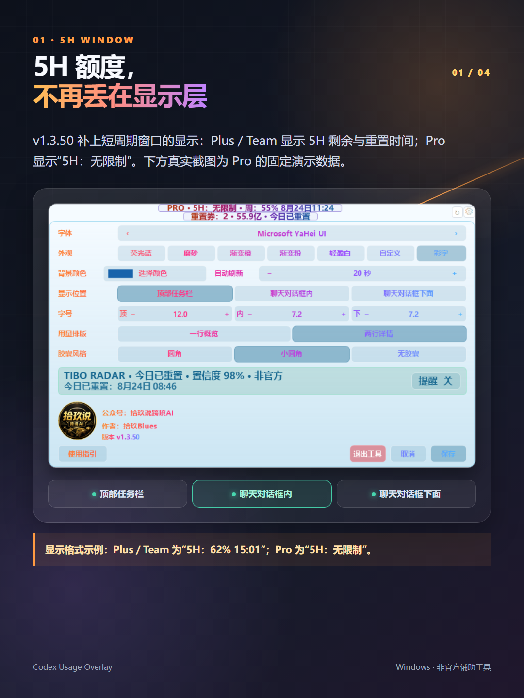
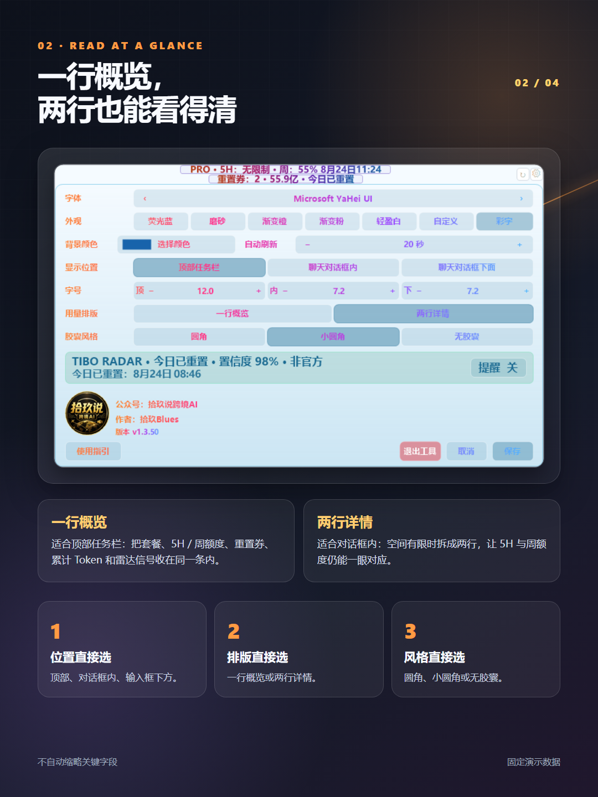
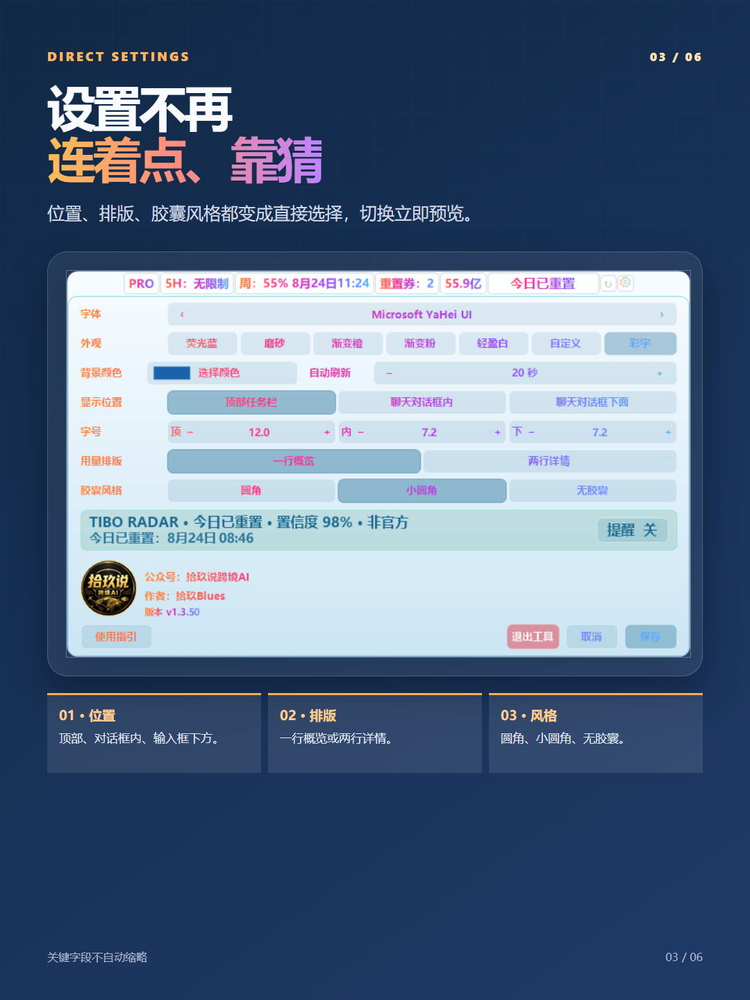
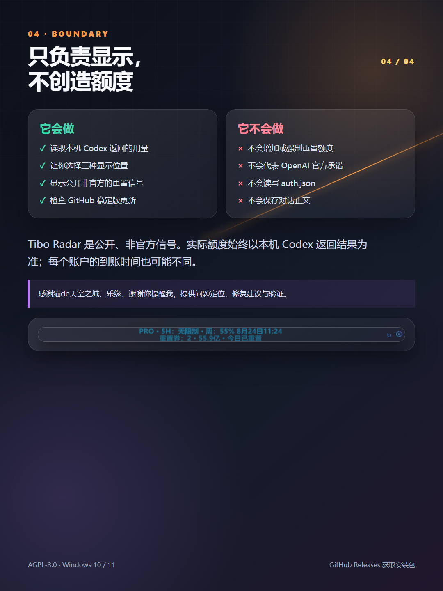

# 小红书发布包 · Codex Usage Overlay v1.3.50

发布状态：待用户确认；未调用发布接口 
账号：拾玖说跨境AI 
排版风格：`lab-launch` 黑金研究所 
选择理由：工具更新需要首图说清变化，再用真实界面截图与边界兑现 
图片节奏：封面 → 直接选择 → 主题对比 → 边界 
可见范围：待确认（首次联调建议仅自己可见） 
商品绑定：无 
定时发布：无 
原创声明：是

## 最终标题

Codex更新：5小时额度显示

## 正文

朋友发来截图时，5 小时额度已经被 Codex 读到了，顶部悬浮条却只显示周额度。

这次 v1.3.50 先把这个显示层问题补上：Plus／Team 会显示 5H 剩余与重置时间；Pro 会明确显示“5H：无限制”。

同时，我把最常切换的设置也改成了看得见、直接点：

1、显示位置：顶部任务栏／聊天对话框内／聊天对话框下面。

2、用量排版：一行概览／两行详情。

3、胶囊风格：圆角／小圆角／无胶囊。

顺手也补了浅色标题栏里无胶囊模式的文字对比，主题切浅了，5H、周额度、刷新和设置按钮也不该糊成一团。

边界还是要说清楚：它只读取并展示本机 Codex 返回的用量。Tibo Radar 是公开、非官方信号，不代表你的账号一定同步到账；工具不能增加额度、绕过限制或主动触发重置。

Windows 10/11 可用，项目按 AGPL-3.0 开源。安装包、SHA-256 和源码都在 GitHub Release。

感谢猫de天空之城、乐缘、谢谢你提醒我，提供问题定位、修复建议与验证。

## 话题

#Codex #AI工具 #Windows软件 #程序员工具 #开源项目 #效率工具 #桌面工具 #GitHub

## 轮播顺序

### 1. 封面｜5 小时额度，终于显示出来

### 2. 额度与设置｜5H、周额度和三项直接选择

### 3. 主题对比｜无胶囊也要看得清

### 4. 边界｜只显示，不创造额度

## 发布前检查

- [x] 标题不含虚假收益、官方背书、到账承诺或夸张表述
- [x] 正文说明 Tibo Radar 为公开非官方信号，不承诺账户到账
- [x] 明确工具不增加额度、不绕过限制、不主动触发重置
- [x] 商品绑定为无、定时发布为无、原创声明拟设为是
- [x] 图片只使用当前程序导出截图和原创信息排版，不含账号、对话正文、Cookie、验证码、凭据、二维码或联系方式
- [x] 未放公众号链接、二维码、微信号或站外联系方式
- [x] 四张 1080×1440 图片已导出并逐张目检
- [ ] 已展示本轮完整标题、正文、话题、图片顺序、可见范围、原创声明和商品绑定并取得明确确认
- [ ] 发布当天已按小红书创作中心提示复核原创声明与可见范围

合规风险：**绿**。内容为原创工具更新，使用真实界面证据；发布前仍需在平台确认原创声明和可见范围。
