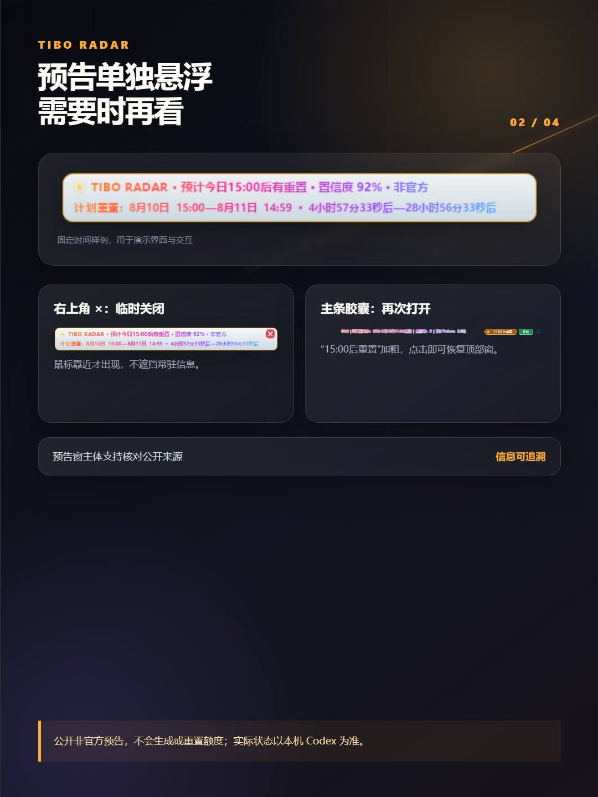
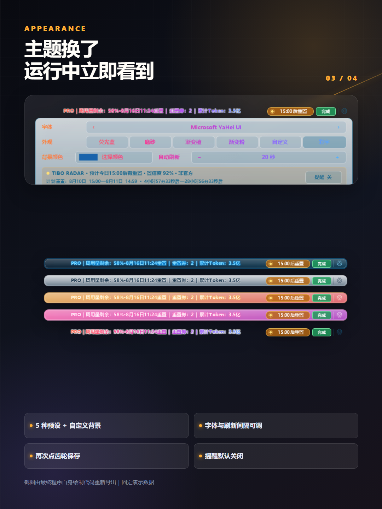
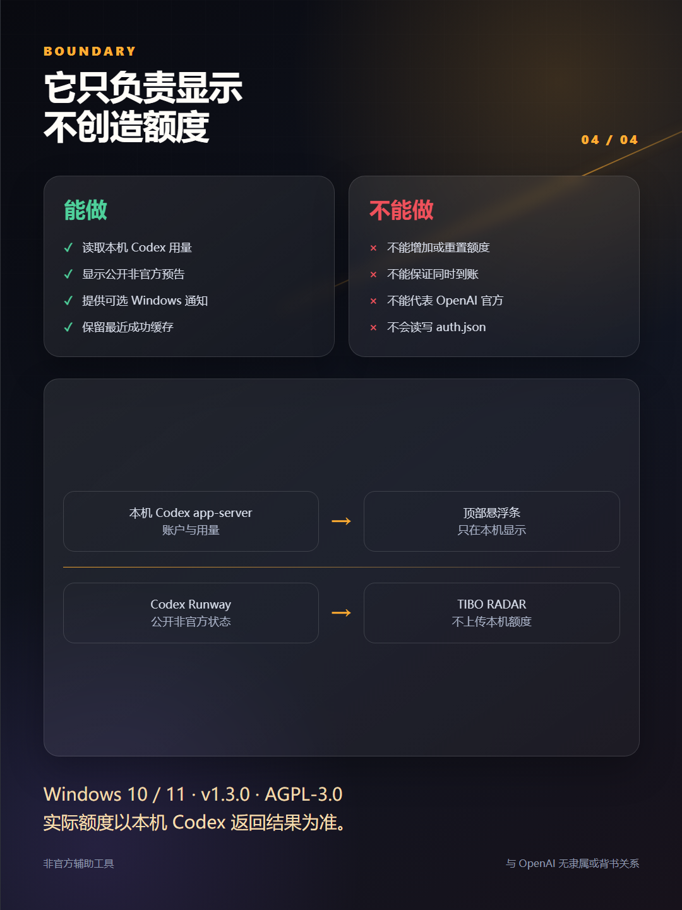

# 小红书发布包：Codex Usage Overlay v1.3.1

发布状态：**发布流程已完成（官方 `/publish/success` 已确认；PostID 未返回）** 
发布时间：2026-08-10 17:45（Asia/Shanghai） 
索引状态：精确标题首次复核未出现，未重复提交 
账号：拾玖说跨境AI 
图片：4 张，均为 1080×1440 
商品绑定：无 
定时发布：无
可见范围：公开可见
原创声明：是

## 最终标题

Codex悬浮条：Tibo预告也能看

## 正文

写 Codex 写到一半，又要去设置里看周用量？

我把套餐、周用量剩余、重置时间、重置券、累计 Token 和任务状态，放进了跟随 Codex 窗口的顶部悬浮条。

v1.3.1 这次主要更新了四件事：

1、接入 Tibo Radar 的公开非官方重置预告。有明确计划时，上方会显示预计时段、置信度和倒计时；可以临时关闭，也能从主条重新打开。

2、修复不同电脑、多显示器缩放不一致时，文字空白、错位或裁切的问题。对不适合正文的字体会自动使用安全字体，并针对常见的 125%、150%、200% 缩放补了兼容处理和测试。

3、加入 GitHub 新版本提示。程序会在后台检查稳定版 Release，发现新版时显示 Windows 提醒，点击可以查看对应页面；不会自动下载，也不会自动安装。

4、右键主条里的“PRO｜周用量剩余…”正文即可退出程序；右键重置胶囊、任务状态、齿轮或顶部预告窗都不会误触退出。

边界也要说清楚：

它只负责显示和提醒，不能增加额度，也不能替你“重置额度”。Tibo Radar 使用公开的非官方状态源，不保证每个账户同时到账；实际用量始终以本机 Codex 返回结果为准。

账户与用量由本机 Codex app-server 提供；不读写 auth.json，不保存对话正文，也不会把账户令牌或本机用量发送给 Radar。

适用 Windows 10/11，项目以 AGPL-3.0 开源。安装包以 GitHub Release 实际内容为准，下载后可核对 SHA-256。

这是非官方辅助工具，与 OpenAI 无隶属或背书关系。

## 话题

#Codex #TiboRadar #AI工具 #Windows软件 #效率工具 #程序员工具 #开源项目 #GitHub

## 轮播顺序

### 1. 封面

### 2. Tibo Radar 交互

### 3. 主题与设置

### 4. 功能边界

## 发布前检查

- [x] GitHub 公开仓库已包含 AGPL-3.0 `LICENSE`、来源说明和本次最终提交。
- [x] GitHub `v1.3.1` 已发布为公开稳定版并标记为 Latest，安装包与 SHA-256 可访问。
- [x] 四张图均来自本轮最终版，不混用旧截图。
- [x] 图片无聊天正文、真实账户、真实额度、Token、路径、标签页、Cookie、验证码、凭据、二维码或联系方式。
- [x] 未使用 `docs/images/support-wechat.png` 赞赏二维码。
- [x] 无外部联系方式、下载链接、商品绑定或商业合作表述。
- [x] 具体预告日期已明确为固定演示时间，不包装成长期有效消息。
- [x] 发布前重新展示标题、正文、话题和 4 张图的完整预览，取得新的明确确认。
- [x] 按发布当天的小红书入口核对原创声明。

本文件记录已确认的发布内容与发布结果；搜索索引可能延迟，未进行重复提交。
